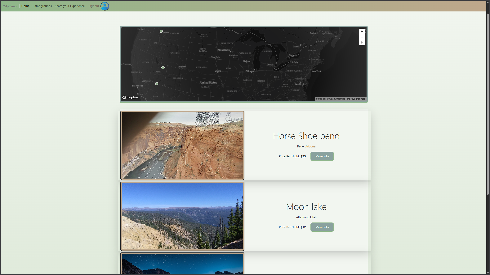

My version of the cole steele Application in his bootcamp - YelpCamp

## Environment Variables

This project requires the following `.env` values:

- **MONGOPASS** – your MongoDB URI
- **CLOUDINARY_CLOUD_NAME** – Cloudinary cloud name
- **CLOUDINARY_KEY** – Cloudinary API key
- **CLOUDINARY_SECRET** – Cloudinary API secret
- **MAPBOX_TOKEN** – Mapbox access token
- **SECRET** – session secret
- **PORT** – defaults to 3000

---

## Screenshots

